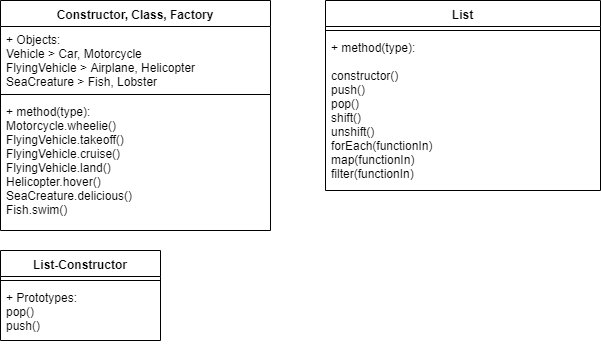

 LAB 02
==============================================

## LAB 02

### Authors:
Connor Sihon

Karl Polintan

### Links and Resources
* [repo](https://github.com/polink/lab-02-401n12-JS)
* [travis](https://www.travis-ci.com/polink/lab-02-401n12-JS)

### Object Modules
#### `index.js`
##### Exported Values and Methods
N/A; only references other files.

#### `constructor.js`
#### `class.js`
#### `factory.js`
Combined functions below, as these files create the same objects, but go about it in different ways.

##### Exported Values and Methods

###### `Vehicle(name, wheels)`
###### `Vehicle.drive() -> 'Moving Forward.'`
###### `Vehicle.stop() -> 'Stopping'`
###### `Car -> new Vehicle`
###### `Motorcycle -> new Vehicle`
###### `Motorcycle.wheelie() -> 'Wheee!'`
###### `FlyingVehicle(name, type)`
###### `FlyingVehicle.takeoff -> 'Takeoff!'`
###### `FlyingVehicle.cruise -> 'Reaching cruising altitude.'`
###### `FlyingVehicle.land -> 'Landing...'`
###### `Airplane -> new FlyingVehicle`
###### `Helicopter -> new Vehicle`
###### `Helicopter.hover -> 'Maintaining hover position.'`
###### `SeaCreature(name, type)`
###### `SeaCreature.delicious -> return true`
###### `Fish -> new SeaCreature`
###### `Fish.swim -> 'Just keep swimming.'`
###### `Lobster -> new SeaCreature`
###### Exported Objects: `Car, Motorcycle, Airplane, Helicopter, Fish, Lobster`

#### List Module
#### `list.js`

#### Tests
* To run tests, please use the `npm run test` command.

#### UML

